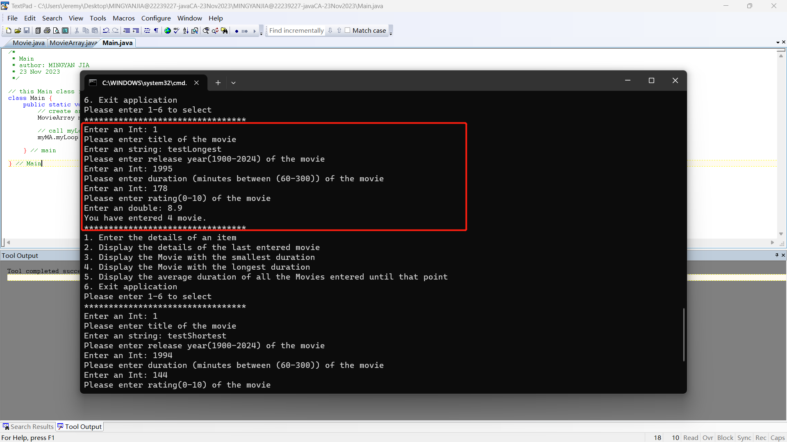
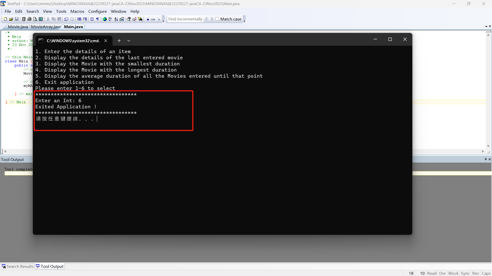

```
* title: java CA
* author: Mingyan Jia
* student number: 22239227
* date: 23 Nov 2023
```
***
## <center>Table of Contents
+ a.   IPO
+ b.   Class diagram
+ c.   decisions that taken in designing and implementing
+ d.   Source code explanation
+ e.1  compile
+ e.2  run main()
+ e.3  exit the running
+ f.   backup source codes

***
<br>

#### <center>a. IPO
<p align="center">
  
</p>

1. input
```
* String title refers to the title of movie.
* int duration refers to time length of movie.
* Double rating refers to the rates of movie.
* int YearOfRelease refers to the year of released.
* selection is show in switch...case syntax for select branch.
```
2. main processing
```
* printSmallestDuration() is used to calculate the smallest duration and referred instance.
* printLongestDuration() is used to calculate the longest duration and referred instance.
* printAverageDuration() is used to calculate average duration of all items.
```
3. output
```
* smallestDuration refers to the smallest the duration itself and the referred item.
* longestDuration refers to the longest the duration itself and the referred item.
* averageDuration refers to the average duration of all items.
* myLoop() is the function contained loop and switch branch that user can select.
* Movie details (title, duration, rating, yearOfRelease)
```
***

#### <center>b. Class diagram
<p align="center">
  
</p>

***

#### <center>c. decisions that taken in designing and implementing
```
* In my case, overall thinking is one Movie class is needed to wrap all relevant fields
  and functions.
* Another MovieArray class is used to contain loads of Movie instances and relevant
  function.
* Main class is the entrance to run the script.
* Exception is needed to make codes stronger.
```
***

#### <center>d. Source code explanation
```
* In Movie class, there are several getter and setter function to set and get fields, toString() is used to print instance.
* Additional, intInput(), doubleInput(), stringInput() are used to pass different types of
  data to instance
* In MovieApp class, myLoop() is used to provide user to select branch
* Additional, makeInstance() is used to create a new Movie instance when called.
* printSmallestDurationMovie(), printLongestDurationMovie(), printAverageDuration() are
  used to print min, max, avg.
* exception (try..catch) is used to catch the error when unmatched type is entered and keep  the script running.
```
***

#### <center>e.1 compile
<br>
<br>
<br>
***

#### <center>e.2 run main()
1. when call the main()
<br>
2. enter items
<br>
<br>
<br>
3. last item
<br>
4. shortest
<br>
5. longest
<br>
6. average
<br>
7. enter another item with same duration as shortest item to demonstrate the first item is printed
<br>
<br>
8. enter another item with same duration as longest item to demonstrate the first item is printed
<br>
<br>
***

#### <center>e.3 exit the running
<br>
***

#### <center>f. source codes
1. Movie.java
```java
/*
 * Movie
 * author: MINGYAN JIA
 * 23 Nov 2023
 */
import java.util.Scanner;
import java.util.InputMismatchException;


// Movie class is used as container for instance of movie, provide loads of functions as
// getter and setter of all fields, toString (overflow).
class Movie  {
    // declaration
    protected String title;
    protected int duration;
    protected Double  rating;
    protected int yearOfRelease;

    // create an instance of Scanner
    Scanner scanner = new Scanner(System.in);

    // constructor
    public Movie() {}

    // getDuration
    public int getDuration() {
        return duration;
    }

    // setDuration
    public void setDuration() {
        int duration ;
        while(true){
            System.out.println("Please enter duration (minutes between (60-300)) of the movie");
            duration = intInput();
            if(duration>=60 && duration<=300){
                this.duration = duration;
                break;
            }// if
        }
    }

    // getRating
    public Double getRating() {
        return rating;
    }

    // setRating
    public void setRating() {
        Double rate ;
        while(true){
            System.out.println("Please enter rating(0-10) of the movie ");
            rate = doubleInput();
            if(rate>=0 && rate<=10){
                this.rating = rate;
                break;
            }// if

        }// while

    }// setRating

    // getTitle
    public String getTitle() {
        return title;
    }

    // setTitle
    public void setTitle() {
        System.out.println("Please enter title of the movie");
        this.title = stringInput();
    }

    // getYearOfRelease
    public int getYearOfRelease() {
        return yearOfRelease;
    }

    // setYearOfRelease
    public void setYearOfRelease() {
        int year ;
        while(true){
            System.out.println("Please enter release year(1900-2024) of the movie ");
            year = intInput();
            if(year>=1900 && year<=2024){
                this.yearOfRelease = year;
                break;
            }// if

        }// while

    }

    // toString
    @Override
    public String toString() {
        return "Movie{" +
                "title='" + title + '\'' +
                ", yearOfRelease=" + yearOfRelease +
                ", duration=" + duration +
                ", rating=" + rating +
                '}';
    }


    // this function is used to get an int enter
    public int intInput() {
        // use exception to make codes stronger
        while (true) {
            try {
                System.out.print("Enter an Int: ");
                return scanner.nextInt(); // return an int
            }

            catch (InputMismatchException e) {
                System.out.println("Invalid input, Please enter an integer !");
                scanner.nextLine();  // Clear the invalid input from the scanner
            }
        } // while
    } // intInput

    // this function is used to get a Double enter
    public Double doubleInput() {
        // use exception to make codes stronger
        while (true) {
            try {
                System.out.print("Enter an double: ");
                return scanner.nextDouble(); // return a double
            }
            catch (InputMismatchException e) {
                System.out.println("Invalid input, Please enter an Double !");
                scanner.nextLine();  // Clear the invalid input from the scanner
            }
        } // while
    } // doubleInput

    public String stringInput() {
        // use exception to make codes stronger
        while (true) {
            try {
                System.out.print("Enter an string: ");
                return scanner.nextLine(); // return a string
            }
            catch (InputMismatchException e) {
                System.out.println("Invalid input, Please enter an string !");
                scanner.nextLine();  // Clear the invalid input from the scanner
            }
        } // while
    } // stringInput

} // Movie
```
***

2. MovieArray.java
```java
/*
 * MovieArray
 * author: MINGYAN JIA
 * 23 Nov 2023
 */

/*
 * this class is used for store instances of Movie and provide function as below
 * printSmallestDurationMovie, printLongestDurationMovie, printAverageDuration
 */
public class MovieArray {

    // declaration
    // new an array that contains instances of Movie.
    Movie[]  movieArrayList = new Movie[15];
    // Store how many instances in the array, Initialize the size to 0.
    public int size = 0;


    // loop
    public void myLoop(){

        // try to reuse intInput(), I named a intInput() in Movie(cause we didn't learn the Interface).
        // create an instance of Movie class.
        Movie reuseInput = new Movie();
        int selection;

        // use case flow control to create different branch
        do {
            // print prompt information
            System.out.println("1. Enter the details of an item \n" +
                    "2. Display the details of the last entered movie \n" +
                    "3. Display the Movie with the smallest duration \n" +
                    "4. Display the Movie with the longest duration \n" +
                    "5. Display the average duration of all the Movies entered until that point  \n" +
                    "6. Exit application \n" + "Please enter 1-6 to select \n*********************************");

            // use a nested do....while to get a valid int enter between scope of 1 to 6
            // reuse the intInput() (link to Movie class)
            do {
                selection = reuseInput.intInput();
            } while (selection <= 0 || selection >= 7);


            // from case 1 to 6, refer to different branch
            switch (selection) {

                // Enter the details of an item
                case 1:
                    // make an instance of Movie and add 1 to  size(refer to count of instance that created ).
                    movieArrayList[size++] = makeInstance();
                    System.out.printf("You have entered %s movie.\n", size);
                    System.out.println("*********************************");
                    break;

                // The details of the last entered movie
                case 2:
                    // print last item that entered
                    // when  the size is 0, print remind to enter item first.
                    if (size != 0) {
                        Movie item = movieArrayList[size-1];
                        System.out.println("Last entered movie is \n"+ item.toString());

                    }else{
                        System.out.println("Please enter items first !!!!! ");
                    }
                    System.out.println("*********************************");
                    break;

                // The Movie with the smallest duration
                case 3:
                    // print movie with the shortest duration
                    // when  the size is 0, print remind to enter item first.
                    if (size != 0) {
                        System.out.println("The Movie with the shortest duration is ");
                        printSmallestDurationMovie();

                    }else{
                        System.out.println("Please enter items first !!!!! ");
                    }
                    System.out.println("*********************************");
                    break;

                // The Movie with the longest duration
                case 4:
                    // print movie with the longest duration
                    // when  the size is 0, print remind to enter item first.
                    if (size != 0) {
                        System.out.println("The Movie with the longest duration is ");
                        printLongestDurationMovie();

                    }else{
                        System.out.println("Please enter items first !!!!! ");
                    }
                    System.out.println("*********************************");
                    break;

                // Average duration of all the Movies entered until that point.
                case 5:
                    // print average duration.
                    // when  the size is 0, print remind to enter item first.
                    if (size != 0) {
                        System.out.println("Average duration of all the Movies is ");
                        printAverageDuration();

                    }else{
                        System.out.println("Please enter items first !!!!! ");
                    }
                    System.out.println("*********************************");
                    break;

                // Exit application
                case 6:
                    System.out.println("Exited Application ! ");
                    System.out.println("*********************************");
                    break;

            } // switch

        } // do
        while(selection !=6 );

    } // myLoop

    // create an instance of Movie and pass values
    private Movie  makeInstance(){
        // create a Movie instance
        Movie movie = new Movie();

        // setTitle
        movie.setTitle();
        // setYearOfRelease
        movie.setYearOfRelease();
        // setDuration
        movie.setDuration();
        // setRating
        movie.setRating();
        return movie;
    } // makeInstance

    // printSmallestDurationMovie
    public void printSmallestDurationMovie(){
        // calculate the min duration
        int  minDuration = movieArrayList[0].getDuration();
        for (int i=0; i<size; i++){
            if(movieArrayList[i].getDuration()<minDuration){
                minDuration = movieArrayList[i].getDuration();
            }
        } // for

        // print min duration and the first Movie instance that has the duration.
        for (int i=0; i<size; i++) {
            // compare each duration with min duration.
            if (movieArrayList[i].getDuration() == minDuration) {
                System.out.println("the shortest duration:  "+ minDuration + " - " + movieArrayList[i]);
                break;
            }
        } // for
    } // printSmallestDurationMovie

    // printLongestDurationMovie
    public void printLongestDurationMovie(){
        // calculate the maximum duration
        int  maxDuration = movieArrayList[0].getDuration();
        for (int i=0; i<size; i++){
            if(movieArrayList[i].getDuration()>maxDuration){
                maxDuration = movieArrayList[i].getDuration();
            }
        } // for

        // print max duration and the first Movie instance that has the duration.
        for (int i=0; i<size; i++) {
            if (movieArrayList[i].getDuration() == maxDuration) {
                System.out.println("the longest duration: " + maxDuration + " - " + movieArrayList[i].toString());
                break;
            }
        }// for

    } // printLongestDurationMovie

    // printAverageDuration
    private void printAverageDuration(){
        // calculate avg duration
        int totalDuration = 0;
        for (int i=0; i<size; i++) {
            totalDuration+=movieArrayList[i].getDuration();
        } // for

        System.out.println((double) totalDuration/size); // transfer to double
    } // printAverageDuration

} // MovieArray
```
***

3. Main.java
```java
/*
 * Main
 * author: MINGYAN JIA
 * 23 Nov 2023
 */

// this Main class is the program entrance.
class Main {
    public static void main(String[] args) {
        // create an instance of MovieArray
        MovieArray myMA = new MovieArray();

        // call myLoop()
        myMA.myLoop();

    } // main

} // Main
```
